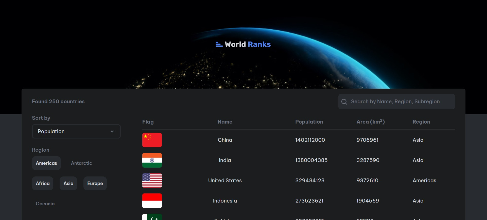
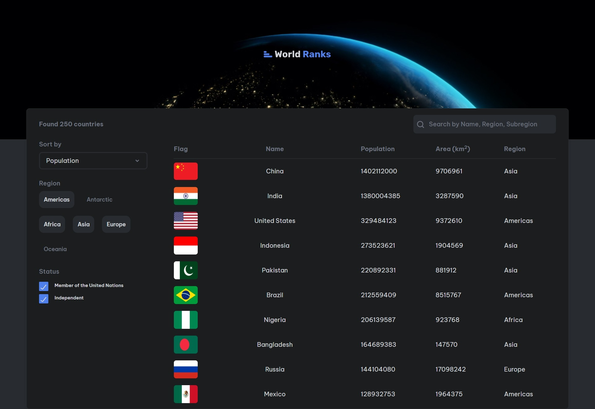
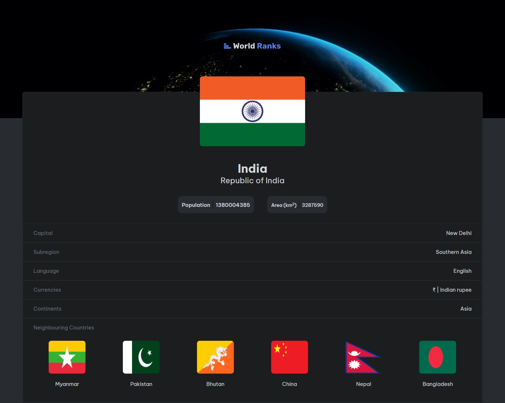

# World Rank

World Rank is a React app built with Vite that leverages the [restcountries.com](https://restcountries.com/) public API to fetch data. This app utilizes the `createAsyncThunk` method from Redux Toolkit along with Axios for fetching data and Redux Toolkit for state management.

## Features

### First Page

The first page displays data from the API and offers a versatile search experience:

- **Search by Name:** Users can search for countries by their name, allowing for quick and precise results.
- **Search by Region:** Explore countries within specific regions like Asia, Africa, Americas, Oceania, Europe, and Antarctica.
- **Search by Subregion:** Further refine your search by exploring countries within specific subregions.

Additionally, the first page provides convenient sorting options:

- **Sorting:** Arrange countries based on population, name, and area.

### Second Page

The second page, accessible by clicking on a country from the first page, provides detailed information, including:

- Flag
- Name
- Official name
- Population
- Area
- Capital
- Subregion
- Language
- Currencies
- Continent
- Neighbouring countries

Clicking on neighbouring countries navigates to the detailed page for that country.

## Dependencies

The app relies on the following dependencies:

- [@reduxjs/toolkit](https://redux-toolkit.js.org/)
- [axios](https://axios-http.com/)
- [react-redux](https://react-redux.js.org/)
- [react-router-dom](https://reactrouter.com/)
- [react-spinners](https://www.npmjs.com/package/react-spinners)
- [tailwindcss](https://tailwindcss.com/)

Feel free to explore the codebase and contribute to the project!
